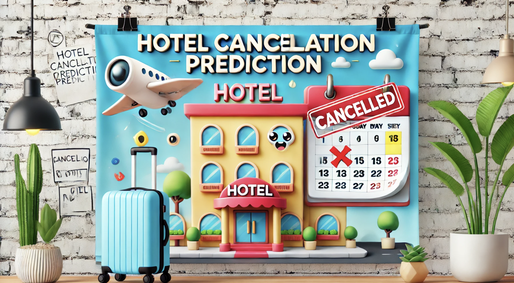

# Hotel Booking Cancellation Prediction ML Model



## Table of Contents
1. [Introduction](#introduction)
2. [Dataset](#dataset)
3. [EDA Insights](#eda-insights)
4. [Model training (including feature selection)](#model-training-(-including-feature-selection))
5. [Prerequisites](#prerequisites)
6. [Steps to Install](#steps-to-install)
7. [Steps to Create the Docker Container and Run the Service](#steps-to-create-the-docker-container-and-run-the-service)
8. [Using the model by using an API using a Lambda function in AWS](###-Using-model-in-AWS)

----
## Introduction
#### Problem Description
The hospitality industry faces a significant challenge with booking cancellations, as approximately 33% of hotel bookings are canceled. This high cancellation rate poses financial risks and logistical challenges for hotels, impacting revenue forecasting and room availability management. 

Understanding the factors behind these cancellations and being able to predict them is crucial for hotels. A timely prediction model will allow hotels to make better decisions, such as optimizing room inventory and adjusting marketing strategies, leading to increased profitability and customer satisfaction. This model can help hotels mitigate the losses from cancellations by:

- **Proactively managing capacity**: Freeing up rooms when there is a high likelihood of cancellation will allow hotels to accept more bookings, maximizing revenue.
- **Personalizing customer engagement**: Hotels could target customers with higher cancellation probabilities with tailored offers or reminders to encourage commitment.
- **Operational efficiency**: A prediction model helps staff to allocate resources based on predicted cancellations (e.g., preparing fewer rooms for cleaning or adjusting staffing schedules).

By predicting cancellations, this model aims to help hotels optimize their operations, reduce revenue loss, and enhance customer experience.

----
## Dataset
The database used for the model consists in a set of bookings from a hotel with a unique id called ¨boooking_id¨ from 2017 and 2018.

There are no missing values in any of the columns.

### Column Names and Data Types

- **Booking_ID (object)**: A unique identifier for each booking made at the hotel. It can be used for referencing a particular booking record.

- **no_of_adults (int64)**: The number of adults included in the booking. This value helps determine the size and requirements of the room or service.

- **no_of_children (int64)**: The number of children included in the booking. This value, along with the number of adults, may help decide room requirements or the need for additional services such as extra beds.

- **no_of_weekend_nights (int64)**: The number of weekend nights (typically Friday and Saturday nights) in the booking. This could indicate higher demand during weekends, which could affect the likelihood of cancellations.

- **no_of_week_nights (int64)**: The number of weeknights (typically Sunday to Thursday nights) in the booking. This can help to identify the pattern of booking durations and potentially different cancellation rates for weekdays versus weekends.

- **type_of_meal_plan (object)**: Describes the type of meal plan included in the booking (e.g., breakfast only, half board, full board, or all-inclusive). This may affect customer satisfaction and cancellation behavior.

- **required_car_parking_space (int64)**: Indicates whether the customer has requested parking space during their stay. It could reflect the customer's need for convenience or transportation and might be related to the cancellation decision.

- **room_type_reserved (object)**: Specifies the type of room the guest has reserved (e.g., single, double, suite). Room preferences can be linked to customer satisfaction, which might influence cancellation rates.

- **lead_time (int64)**: The number of days between the booking date and the scheduled arrival date. A longer lead time might suggest less likelihood of cancellation, while short-term bookings might be more prone to cancellation.

- **arrival_year (int64)**: The year in which the booking is scheduled to arrive. This can be useful for analyzing seasonal patterns and trends in cancellations over the years.

- **arrival_month (int64)**: The month of the scheduled arrival. It is useful for identifying seasonal trends in booking cancellations and can help account for periods with higher cancellation rates.

- **arrival_date (int64)**: The specific date of arrival (day of the month). This may help analyze cancellations during peak or off-peak days of the month.

- **market_segment_type (object)**: Describes the segment of the market from which the booking originated (e.g., direct, corporate, online travel agents, etc.). Different market segments could have varying cancellation rates, depending on their typical customer behavior.

- **repeated_guest (int64)**: A flag indicating whether the guest is a repeat customer (1 for repeat guests, 0 for first-time guests). Repeat guests may be less likely to cancel, as they have already established trust with the hotel.

- **no_of_previous_cancellations (int64)**: The number of previous bookings made by the guest that were cancelled. A higher number of previous cancellations could be a predictor for future cancellations.

- **no_of_previous_bookings_not_canceled (int64)**: The number of previous bookings made by the guest that were not cancelled. This can provide insight into the guest's general booking behavior and predict the likelihood of cancellation.

- **avg_price_per_room (float64)**: The average price per room booked by the customer. Higher-priced bookings may be less likely to be cancelled, as the cost is more substantial for the guest.

- **no_of_special_requests (int64)**: The number of special requests made by the guest (e.g., room preferences, extra beds, or other accommodations). A higher number of requests could indicate a higher likelihood of the booking being special to the guest and less likely to be cancelled.

- **booking_status (object)**: The status of the booking, indicating whether it was cancelled or not. This is the target variable for the machine learning model, representing the outcome we aim to predict (cancelled or not).

### New Columns Created

- **total_people**: The number of total people in the booking (adults & kids). This column represents the total occupancy for the booking.

- **price_per_adult** and **price_per_person**: Average price per night by adult or person in the booking (including kids). These columns provide a breakdown of the cost per individual in the booking.

- **has_previous_cancellations**: A flag indicating whether the user has previous cancellations. Instead of using the exact number of previous cancellations, this flag simply identifies if the guest has had cancellations before.

- **has_previous_bookings_not_cancelled**: A flag indicating whether the user has previous bookings that were not cancelled. This flag is used due to data limitations and replaces the exact number of previous bookings that were not cancelled.

- **total_nights**: The total amount of nights per booking. This column sums up the total nights the guest will stay at the hotel.

- **have_children**: A flag indicating whether the booking includes children. This flag replaces the exact number of children, simplifying the analysis.

----
## EDA Insights
- **Room Type**: We can see that for room types, the majority are of type 1 and 4. Room types 1, 2, and 4 seem to be booked by two people, while types 3 and 5 are booked by fewer people (possibly more individual guests), and types 6 and 7 are booked by 3 or more people. We observe that rooms with fewer guests on average have lower cancellation ratios.

- **Total People**: The majority of bookings are for two people, followed by bookings for one and three people. Interestingly, single-person bookings tend to have fewer cancellations compared to bookings with more people. This could potentially be linked to work-related trips or other factors.

- **Lead Time**: The distribution of this property, which indicates how far in advance bookings are made, is particularly interesting. We observe that as the booking date approaches, the number of bookings increases, with the median lead time being 60 days. However, unexpectedly, the cancellation ratio also rises with longer lead times, suggesting that bookings made further in advance are more likely to be canceled.

- **Price per Room**: On average, users pay 99 euros per room per day, with the first quartile at 80 euros and the third quartile at 120 euros. There are also some extreme high values in the price distribution. We see a positive correlation between higher prices and higher cancellation ratio, but is not super strong.

- **Price per Room and Person**: On average, users pay 51 euros per room per day and per person in the booking, with the first quartile at 42 euros and the third quartile at 66 euros. There are also some extreme high values in the price distribution. We see a positive correlation but less strong than the total price per day

- **Number of special Requests**: More special requests correlates with lower cancellation ratio.

- **Price per Room**: Most bookings are made online, and these tend to have the highest cancellation ratio. In contrast, bookings made by corporate clients have a lower cancellation ratio, which makes sense since these are typically business trips, and corporate travelers may be less price-sensitive.

- **Repeated Guest**: Repeat guests make up only 2.3% of all bookings, but their cancellation ratio is significantly lower compared to first-time guests.

- **Has previous cancellations**: Users who cancelled before have less cancellation ratio but also are just a 0.8%.

- **Required Car Parking Space**: Only 3% of users request parking, but this significantly lowers the cancellation ratio.

- **Type of Meal Plan**: 76% of users request Meal Type 1, while 8.7% choose Meal Type 2. The remaining 14% do not request a meal. The cancellation ratio is notably higher among users who select Meal Type 2.

- **Total Nights**: On average, users stay for three nights, with the first quartile at two nights and the third quartile at four nights. Users staying for just one night have a significantly lower cancellation ratio. However, the cancellation ratio increases notably for stays longer than five nights.

- **Type of Stay in Terms of Weekday-Weekend**: Around half of the bookings include both weekdays and weekends, while a similar proportion are for weekdays only. Bookings for weekends alone are relatively rare. The cancellation ratio is higher for stays that include both weekdays and weekends compared to the other two categories.

- **Type of Stay in Terms of Weekday-Weekend**: Stays with children account for just 6%, with a slightly higher chance of cancellation.

- **Arrival Day of the Week**: Bookings with arrival dates on Sundays exhibit a significantly higher likelihood of cancellation compared to other days. This observation highlights an association between the day of the week and cancellation tendencies.

- **Arrival Month of the Year**: A noticeable increase in cancellation rates is observed during the summer months, suggesting a seasonal trend in booking behavior.

----
## Model training (including feature selection)
The selection of features was based on their relevance to booking cancellations and insights from exploratory data analysis (EDA). We kept variables that had a substantial relationship with the target variable (`booking_status`) while dropping those that were either redundant or irrelevant.

   **Features Included**:
   - `'no_of_weekend_nights'`: The number of weekend nights in the booking, potentially reflecting customer preferences for weekend stays.
   - `'no_of_week_nights'`: The number of weeknights in the booking, helping to capture booking duration patterns.
   - `'type_of_meal_plan'`: The meal plan chosen, which may correlate with customer commitment and their likelihood to cancel.
   - `'required_car_parking_space'`: Whether parking was requested, which might indicate the level of customer commitment.
   - `'room_type_reserved'`: Room type selection, reflecting preferences that might influence cancellation behavior.
   - `'lead_time'`: The time between booking and arrival, as earlier bookings may indicate stronger commitment.
   - `'arrival_month'`: Seasonal trends that affect booking patterns and cancellation rates.
   - `'market_segment_type'`: The segment from which the booking originated (e.g., corporate, online travel agents).
   - `'repeated_guest'`: Whether the guest is a repeat customer, as repeat guests tend to have lower cancellation rates.
   - `'avg_price_per_room'`: Average price per room booked, with higher-priced bookings being less likely to be canceled.
   - `'no_of_special_requests'`: A higher number of special requests correlates with reduced cancellations.
   - `'total_people'`: The total number of people in the booking, which can affect the likelihood of cancellation.
   - `'total_nights'`: The total number of nights booked, indicating the length of the stay.
   - `'have_children'`: Whether children are part of the booking, which can influence the cancellation behavior.
   - `'wday'`: The day of the week the booking is made, as cancellations may vary depending on booking day patterns.

   **Features Dropped**:
   - `'booking_id'`: A unique identifier for the booking, which is not useful for prediction.
   - `'no_of_previous_cancellations'` and `'no_of_previous_bookings_not_canceled'`: These were removed to simplify the model as we instead created binary flags (`has_previous_cancellations` and `has_previous_bookings_not_canceled`) based on their presence.
   - `'arrival_year'`, `'arrival_date'`: These variables did not provide meaningful information for prediction and were removed for clarity.
   - `'price_per_adult'` and `'price_per_person'`: These columns were derived and replaced by `'avg_price_per_room'` for simplicity.


Target output: `booking_status` as `booking_cancelled_flag`, 1 when is cancelled and 0 if not

### Handling Imbalanced Data and Prioritizing Key Metrics
In this project, I applied various **balancing techniques** such as **SMOTE (Synthetic Minority Over-sampling Technique)**, **Random Over/Under Sampling**, and **NearMiss** to address the issue of **class imbalance** in the dataset. Class imbalance occurs when one class has significantly fewer samples than the other, which can lead to biased models that favor the majority class. By using these balancing methods, I ensured that the model received enough data from the minority class, helping it learn better and make more accurate predictions.

After experimenting with different SMOTE ratios, I selected **SMOTE with a ratio of 1.0** for the final model, as it consistently provided the best performance across multiple metrics. Based on the evaluation scores, SMOTE with a 1.0 ratio achieved the highest **AUC**, **Recall**, and **F1 Score**, making it the most balanced approach for this dataset.

To evaluate the model's performance, I prioritized the following metrics:
- **AUC (Area Under the Curve)**: AUC is a reliable metric for classification models, especially when working with imbalanced datasets. It measures how well the model distinguishes between the classes across different decision thresholds, regardless of the class distribution. A higher AUC indicates better overall model performance in distinguishing between the positive and negative classes.
  
- **Recall**: Recall (True Positive Rate) was prioritized to ensure that the model does not miss important positive instances, particularly in cases where **false negatives** could have serious consequences, such as in fraud detection or medical diagnoses.

- **F1 Score**: F1 Score, the harmonic mean of precision and recall, was used to balance both **precision** and **recall**. This is crucial in imbalanced datasets where we want to avoid a model that either favors precision at the expense of recall or vice versa. The F1 Score provides a more comprehensive view of the model's ability to identify both positive and negative instances correctly.

By applying these techniques and focusing on these metrics, I ensured that the model performs well in terms of both **accuracy** and **sensitivity** to the minority class, providing meaningful and reliable predictions.

### Final model
After evaluating multiple models, including Logistic Regression, Random Forest, and XGBoost (with and without hyperparameter tuning), the XGBoost model with tuned parameters emerged as the best performer. It was optimized based on key metrics such as AUC, F1 score, and recall, which were prioritized for this task.

The tuned XGBoost model achieved an impressive AUC score of 95%, indicating strong overall classification performance. Additionally, it achieved an F1 score of 83.4%, reflecting a good balance between precision and recall. The recall value of 80.6% demonstrates the model's ability to correctly identify positive instances, which was crucial for this problem.

By leveraging grid search for hyperparameter tuning, the model parameters were optimized for maximum performance, showcasing the power of XGBoost for this classification task. Given the emphasis on these three metrics, this XGBoost model outperformed other algorithms, making it the best choice for this project.

#### Key Features Influencing Booking Cancellations

The features that best explain booking cancellations at the hotel are:

- **Lead Time**: The time in advance the booking was made.
- **Price per Day and Room**: The cost for a single room per day.
- **Price per Person and Day**: The cost for one individual per day.
- **Month of Arrival**: The month when the guest arrives.
- **Number of Weekdays**: The count of weekdays during the booking.
- **Total Nights**: The total number of nights in the booking.

### Model Performance Summary

The XGBoost model demonstrated strong performance across both the validation and test datasets, achieving high scores in key metrics:

| Dataset       | Accuracy  | Precision | Recall   | F1 Score | ROC AUC  |
|---------------|-----------|-----------|----------|----------|----------|
| **Validation**| 89.55%    | 86.61%    | 80.56%   | 83.48%   | 95.06%   |
| **Test**      | 89.70%    | 86.61%    | 81.11%   | 83.77%   | 95.78%   |

These results indicate the model's robustness and ability to generalize effectively, making it the best-performing model for this problem based on the metrics prioritized: **ROC AUC**, **F1 score**, and **recall**.

-----
## Prerequisites
- **`git`**: To clone the repository.
- **`Anaconda` (`conda`)**: For virtual environment management.
- **`Docker`**: For deployment and testing.
- **`AWS CLI`**: For cloud-based services (optional).

To run AWS ECR (Elastic Container Registry)

-------
## Steps to Install

1. **Clone the repository**:
   Clone the repository to your local machine:
   ```bash
   git clone https://github.com/irenebustos/hotel_cancellations_prediction_model.git

2. create conda environment with python 3.11 or reuse another one existing with this version
 ```bash
   conda create -n ml-hotel-cancellations-pred python=3.11
   ```
3. Activate the the virtual environment:
   ```bash
   conda activate ml-hotel-cancellations-pred 
   ```
4. Install pipenv (if not already installed):  Install pipenv globally using pip:
for that pipenv is needed:
   ```bash
    pip install pipenv
   ```
5. Install dependencies: Navigate to the project directory and run:
```bash
  cd path/to/hotel_cancellations_prediction_model
pipenv install
```
6. Activate the pipenv shell: To activate the environment, use:
   ```bash
   pipenv shell
   ```

-------
## Steps to create the docker container and run the service: 
1. create docker image for this model using official Amazon Web Services (AWS) Lambda base image for Python 3.10.
   ```bash
    docker build --platform linux/amd64 -t hotel-canc-model .
   ```
2. run the docker container: 
   ```bash
    docker run -it --rm --platform linux/amd64 hotel-canc-model .
    ```
3. Open another tab in the terminal and, having the conda env with the required packages activated,  run the example predict_test_.py where there is an example of a booking (values can be modifiyed):

   ```bash
    python predict_test_.py
   ```
To stop the service, press `Ctrl+C` in the terminal.

---- 
## Using model in AWS: AWS Lambda API Deployment and Testing
I have deployed an API on AWS using a Lambda function, which is packaged in a Docker container. The Docker image was published to Amazon Elastic Container Registry (ECR) for easy access. I then created the Lambda function using this container image and exposed the function via an API Gateway. To test and interact with the API, I have been using a Jupyter notebook, sending different events to the Lambda function and analyzing the responses.

To try yourself you can open the file called `predict_test_aws_api.ipynb`, by running it you can test with different event properties and get the prediction from the model.

[]([https://youtu.be/9WMYAk-v2j4](https://youtu.be/ahdo98zABQU))]([https://youtu.be/ahdo98zABQU](https://youtu.be/ahdo98zABQU))


